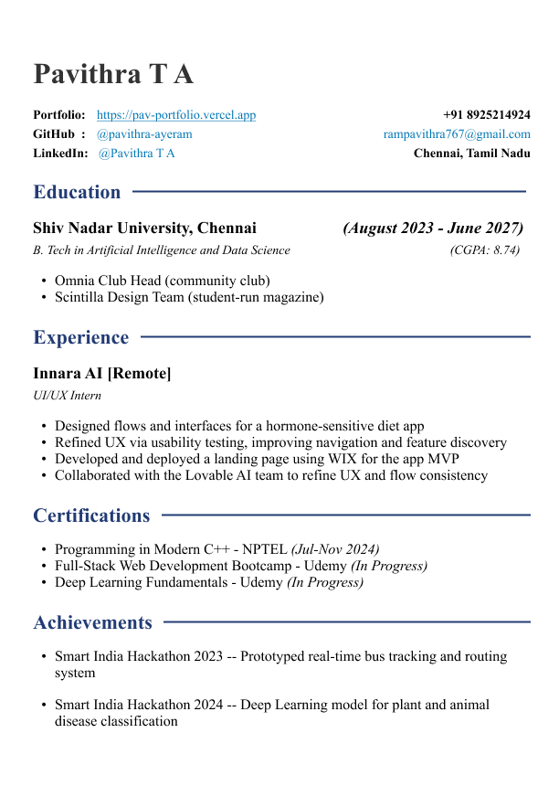

<div class="header">
  <div class="top-left">
    <strong>Lab - 01</strong><br>
    Date: 12/10/2025
  </div>
  <div class="title">HTML & CSS Resume Webpage</div>
</div>


## Question
Create an HTML and CSS webpage that captures a resume (preferably yours) for a fresher full-stack developer at an IT company.  
Push your content to GitHub and maintain proper version control with clear README files.  
Host it using a free third-party hosting platform.

## Design
The design follows a single-page “digital resume” layout with a clean white paper-style card, rounded corners, and soft blue section headings.  
It presents key sections like personal info, skills, projects, and certifications.  

**Design Reference:**


## Code
### Folder Structure
```
lab-1/
|-- index.html
|-- styles.css

```


### index.html
```html
<!DOCTYPE html>
<html>
  <head>
    <title>Pavithra | Resume</title>
    <link rel="stylesheet" href="cv.css">
  </head>
  <body>
    <div class="paper">
      <h1>Pavithra T A</h1>
      <p>AI & Data Science Student | Full-Stack Developer</p>
      <p><a href="https://pav-portfolio.vercel.app">Portfolio</a></p>
    </div>
  </body>
</html>
```

### cv.css

```css
.paper {
  width: 80%;
  margin: 0 auto;
  padding: 40px;
  background-color: white;
  border-radius: 10px;
  box-shadow: 0 0 5px #ddd;
}
```

## Output


## Result
The HTML and CSS webpage for a fresher’s resume was successfully designed, and uploaded to GitHub

GitHub Repository: [Repo Link](https://github.com/pavithra-ayeram/portfolio-website)